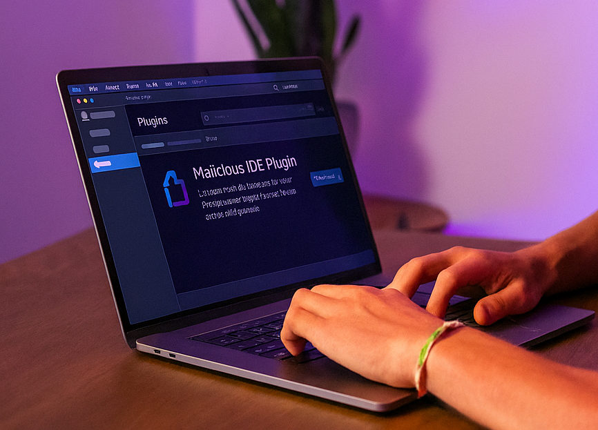

With the growing rise in popularity of vibe coding, bad actors are now targeting a whole new inexperienced group of developers installing plugins for their IDEs. Installing in infected plugin can result in malicious code being executed on the victim's machine, which can result in any number of cyber attacks including additional malware being installed, loss of data, or the compromising of personal data or accounts.

There has never been a more important time to get educated on these types of attacks and how to be vigilent about preventing them. Like other categories of cyber attacks, IDE plugin attacks capitalize on an unsuspecting user's careless habits and ignorance in trusting that the plugin they are downloading from the marketplace is secure.

Developers, especially those newer to vibe coding, can adopt several habits and technical safeguards to minimize risk when installing IDE plugins.

### Steps to Protect Yourself

- **Use Trusted Marketplaces**: Always download plugins from official marketplaces, like JetBrains or Visual Studio. Look for plugins with frequent updates, transparent authorship, and comprehensive documentation. Suspiciously low download numbers, incomplete change logs, or unclear origins are red flags to avoid.
- **Examine Permissions Carefully**: Analyze what resources a plugin wants access to. Avoid plugins demanding unnecessary privileges such as broad network access or modification rights over your project directories. Only grant permissions that are strictly required for your workflow.
- **Monitor Updates**: Even reputable plugins can be maliciously altered through compromised update channels. Disable automatic updates for critical plugins and review changelogs before accepting any new release.
- **Conduct Regular Audits**: Periodically review all installed plugins, checking for inactivity, abandonment, or changes in behavior. Remove outdated plugins that are no longer maintained as they often become soft targets for attackers.
- **Scan Continuously**: Use runtime security tools or antivirus software to monitor extensions for suspicious processes, unauthorized network calls, or abnormal resource usage. Implement real-time scanning for vulnerabilities, especially in AI-suggested code.
- **Sandbox and Isolate**: Run plugins in sandboxed environments and monitor how they interact with system resources. Isolate untrusted or experimental plugins from production environments to reduce potential impact.
- **Limit Plugin Use**: Only install plugins genuinely necessary for development. The more plugins in use, the greater the chance for a security breach.
- **Verify Code Signing & Source Integrity**: Ensure plugins are properly signed, and validate certificates whenever possible to guard against tampering and man-in-the-middle attacks.

Taking these precautions helps defend against the growing threat landscape targeting IDE extensions and vibe coders. Security is not a one-time checklist; it's an ongoing habit of skepticism, vigilance, and informed decision-making. As AI-powered development continues to democratize coding, developers are responsible for staying educated and proactive, because real security comes from both great tools and awareness.

If you or someone you know could benefit from my services, [let's get in touch]({}).